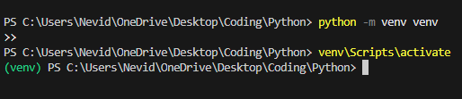

<h1>Use laptop Cam to control components with ESP32


<h2>Function and connections</h2>
 ## ⚙️ Features

- ✅ Real-time face landmark detection using Mediapipe  
- ✅ Calculates **EAR (Eye Aspect Ratio)** for drowsiness detection  
- ✅ Calculates **MAR (Mouth Aspect Ratio)** for yawning detection  
- ✅ Detects **Yaw (head tilt left/right)** for driver attention monitoring  
- ✅ Sends driver state to **ESP32** over Serial  
- ✅ ESP32 lights up LEDs based on driver state:
  - 🟢 **Alert** → LED on Pin 2  
  - 🔴 **Drowsy** → LED on Pin 5  
  - 🔵 **Left** → LED on Pin 18  
  - 🟡 **Right** → LED on Pin 19  
---

## ⚙️ Setup
<h3> Make sure you have **Python 3.8 – 3.11** Most important !!!</h3>
### 1️⃣ Install Python

- run this in Code editor to check:
  ```bash
     python --version 
- <h3>In case you have python 3.13 or more either delete your current python and install python 3.10 or create virtual enviroment</h3>
### 1️⃣steps to create virtual env:

- Fisrst install python 3.10 don't worry it will not overwrite your 3.13
  ```
    https://www.python.org/downloads/release/python-3100/
.
- Create virtual enviroment:run this in cmd or code editor terminal
  ```
    python -m venv venv
    
- Activate Virtual Environment
  ```
  venv\Scripts\activate

- Now make sure you run your pyhton code in activated enviroment always:


- always activate envorement and make sure its green
---
<h3>Neccessary libraries</h3>
- cmd or editor terminal:make sure your in venv if have multiple python versions.

    pip install opencv-python mediapipe numpy pyserial absl-py
-
<h3>Copy codes</h3>

-
  <a href="https://github.com/Nevid-786/IOT_Internet-of-things/blob/main/ESP32%20_microcontroller_with_WebCam/Code_for_webcam/Python_code_to_control_webcam.py">Pyhton code for WebCam</a>

-
  <a href="https://github.com/Nevid-786/IOT_Internet-of-things/blob/main/ESP32%20_microcontroller_with_WebCam/Esp_32_code/esp_final_code/esp_final_code.ino">Arduino code for ESP32</a>
---
  
<h2>Do changes in codes </h2>

- Change COM in python code according to your IDE:

   

-

<h2>Process</h2>

- Flash the esp32 code in your board using arduino ide:
- click reset(EN) button on your board
- run your python code:
- Make sure your COM is correct in python code

## 🖥️ Python Code (Driver State Detection)
- Uses **OpenCV** to capture frames.  
- Uses **Mediapipe FaceMesh** to extract facial landmarks.  
- Calculates **EAR, MAR, and Yaw**.  
- Classifies driver state as:
  - `"Alert"`
  - `"Drowsy"`
  - `"Left"`
  - `"Right"`
- Sends the state to ESP32 via Serial (`COM port`).  

---
<h1>Nevid-786</h1>

